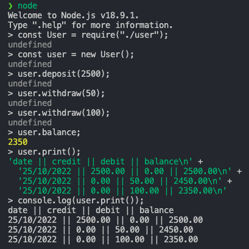

# bank-tech-test
## User stories
- You should be able to interact with your code via a REPL like IRB or Node. (You don't need to implement a command line interface that takes input from STDIN.)
- Deposits, withdrawal.
- Account statement (date, amount, balance) printing.
- Data can be kept in memory (it doesn't need to be stored to a database or anything).
## Introduction
I created a User class which comes with two properties and three methods, covering all the user stories. Following Test-Driven Development, there are three tests covering the methods in User class.

A screenshot of running app in node:


## How to install dependencies
In your terminal:
```bash
# install dependencies locally
npm install
# install jest globally
npm install -g jest
```
## How to interact via Node
1. In node, run commands in sequence.
``` Javascript
const User = require("./user");
const user = new User();
```
2. Functions
``` Javascript
// to deposit money
user.deposit(amount);
// to withdraw money
user.withdraw(amount);
// to check balance
user.balance;
// to print statement
user.print();
```


